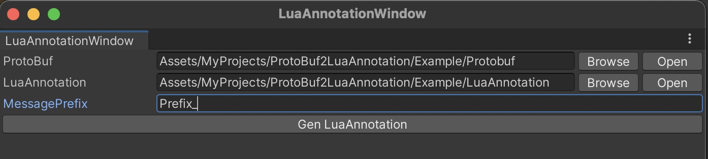
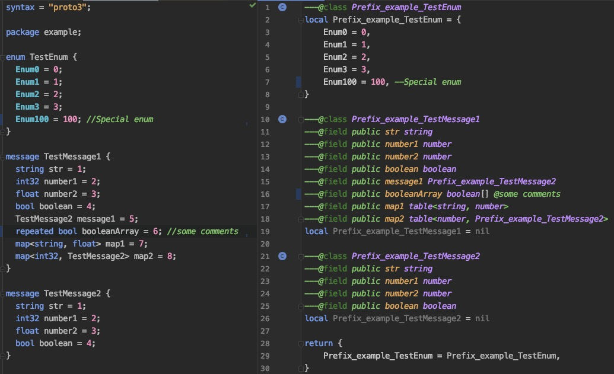

# ProtoBuf2LuaAnnotation
Generate EmmyLua Annotation from ProtoBuf.

# Usage
* Click "Tools/ProtoBuf2LuaAnnotation" menu item to open window.
* Choose ProtoBuf folder and LuaAnnotation folder.
* Click "GenLuaLuaAnnotation" to generate LuaAnnotation scripts to LuaAnnotation folder.

# Proto&Lua

